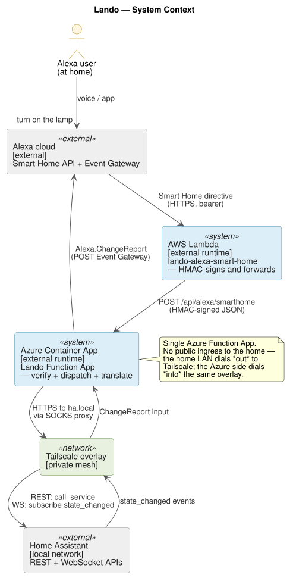

# Lando — Alexa ↔ Home Assistant Bridge

[](https://codecov.io/gh/mirapalheta/lando)
[](https://app.codecov.io/gh/mirapalheta/lando?flags%5B0%5D=dotnet)
[](https://app.codecov.io/gh/mirapalheta/lando?flags%5B0%5D=lambda)

Control your Home Assistant devices by voice through Amazon Alexa — without
exposing your home network to the internet, without a cloud subscription, and
without Nabu Casa.

Lando sits between the Alexa Smart Home API and your local Home Assistant
instance. An AWS Lambda receives the directive, HMAC-signs it, and forwards it
to an Azure Container App that translates it into a Home Assistant REST or
WebSocket call over a Tailscale-encrypted connection.

> **Why this exists** — Alexa's Smart Home API requires a publicly reachable
> HTTPS endpoint. The standard answer is to expose HA directly, pay for Nabu
> Casa, or run a cloud proxy you don't control. Lando is the other answer: a
> small, auditable bridge that keeps your HA instance fully private and handles
> the protocol translation for you. Also, I just really wanted to build this
> myself 🙃

---

## Architecture at a glance



The Azure container app also maintains a persistent WebSocket to Home Assistant
and sends proactive **ChangeReports** to the Alexa Event Gateway whenever a
device state changes — so your Alexa app stays in sync without polling.

Full architecture detail: [docs/architecture.md](docs/architecture.md)

---

## Quickstart

See **[docs/getting-started.md](docs/getting-started.md)** for the 15-minute
local-dev path and the step-by-step Alexa skill registration.

Infrastructure is fully declared in Terraform:

```bash
cd terraform
cp terraform.tfvars.example terraform.tfvars
# fill in HA URL, token, Tailscale key, and Alexa skill IDs
terraform init && terraform apply
```

---

## Supported device types

| Home Assistant domain | Alexa capabilities                                     | Voice examples                               |
| --------------------- | ------------------------------------------------------ | -------------------------------------------- |
| `light`               | PowerController, BrightnessController, ColorController | "turn on", "set to 50%", "set color to blue" |
| `switch`              | PowerController                                        | "turn on / off"                              |
| `cover`               | PowerController, ModeController, RangeController       | "open / close", "set to 40%"                 |
| `fan`                 | PowerController, PercentageController                  | "turn on", "set speed to 60%"                |
| `lock`                | LockController                                         | "lock / unlock"                              |
| `climate`             | ThermostatController                                   | "set to 72 degrees", "set to heat mode"      |
| `media_player`        | PowerController, Speaker                               | "turn on / off", "set volume to 40%"         |
| `sensor`              | TemperatureSensor (numeric temperature sensors)        | "what's the temperature in the kitchen?"     |
| `scene`               | SceneController (activate only)                        | "turn on movie night"                        |
| `script`              | SceneController (activate + deactivate)                | "turn on wake up master bedroom"             |

Device types whose HA domain has no registered transformer are silently skipped
at discovery time — a partial deploy yields a valid (smaller) discovery
response. See [docs/extending-device-types.md](docs/extending-device-types.md)
to add support for a new domain.

---

## Cost

Runs on Azure Container Apps Consumption and AWS Lambda — both billed on usage,
no always-on compute. Typical home use runs **~$8–12/month** total.

Full breakdown in [docs/faq.md](docs/faq.md#what-does-it-cost-to-run).

---

## Security model

| Hop                                  | How it's secured                                                            |
| ------------------------------------ | --------------------------------------------------------------------------- |
| Alexa cloud → AWS Lambda             | Alexa bearer token validated against LWA `tokeninfo`; `aud` pinned to skill |
| AWS Lambda → Azure container app     | HMAC-SHA256 over `timestamp.body`; constant-time verify; ±5 min clock skew  |
| Azure container app → Home Assistant | Bearer token over HTTPS; optional pinned custom CA; routed over Tailscale   |
| Azure container app → Event Gateway  | OAuth2 bearer from per-grantee LWA refresh token stored in Azure Key Vault  |
| Secrets at rest                      | All tokens and keys in Azure Key Vault; managed identity RBAC, no passwords |

The HMAC signature scheme is versioned (`X-Lando-Signature: v1=<hex>`) so both
ends can roll forward in lockstep without a flag day.

---

## Repo layout

| Path         | What's there                                                                                                     |
| ------------ | ---------------------------------------------------------------------------------------------------------------- |
| `src/azure/` | .NET Azure Functions app — directive handlers, HA client, transformers ([README](src/azure/README.md))           |
| `src/aws/`   | TypeScript AWS Lambda proxy — receives Alexa directives, signs with HMAC, forwards ([README](src/aws/README.md)) |
| `terraform/` | All Azure + AWS infrastructure as Terraform ([README](terraform/README.md))                                      |
| `docs/`      | Architecture, getting started, deployment, configuration, troubleshooting, FAQ                                   |

---

## Quality

Test coverage is published publicly and tracked per component. Browse the full
report — including per-file breakdowns for both the .NET function app and the
AWS Lambda — at
[codecov.io/gh/mirapalheta/lando](https://codecov.io/gh/mirapalheta/lando).

---

## Contributing

Contributions are welcome. Please read
[CONTRIBUTING.md](CONTRIBUTING.md) before opening a pull request.

If you find a security issue, follow the responsible disclosure process in
[SECURITY.md](SECURITY.md) rather than opening a public issue.

---

## Disclaimer

> [!CAUTION]
> Lando is hobbyist software provided **as-is**, without warranty of any kind,
> express or implied. Because it controls real-world devices through Home
> Assistant and provisions billable infrastructure on AWS and Azure, please be
> aware that:
>
> - It can lock and unlock doors, arm and disarm security panels, and operate
>   other potentially dangerous devices exposed by your Home Assistant instance.
>   Test thoroughly before relying on it, and never make it the sole control
>   path for anything whose failure mode matters.
> - Misconfiguration (open endpoints, runaway change reports, broken loops) can
>   drive AWS or Azure costs well above the typical $8–12/month figure quoted
>   above. You are responsible for monitoring and paying your own cloud bills.
> - You are responsible for protecting all secrets used by the system (HMAC
>   keys, Alexa bearer tokens, Home Assistant tokens, cloud credentials). A leak
>   of any of these can give an attacker control of devices in your home.
> - This is software maintained in spare time. There is no SLA, no support
>   guarantee, and no commitment to fix bugs in any particular timeframe.
>
> Neither the author nor any contributor is liable for damages, data loss,
> unauthorized device control, cloud-provider charges, or any other consequences
> arising from the use of this software. See [LICENSE](LICENSE) for the full
> MIT terms.

---

## License

[MIT](LICENSE)

**Author:** Dan Mirapalheta
