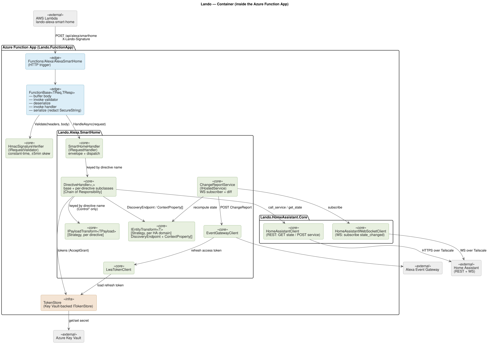
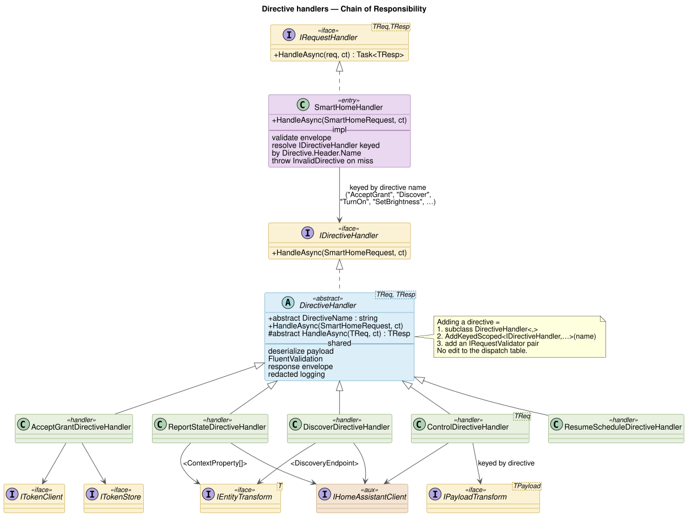
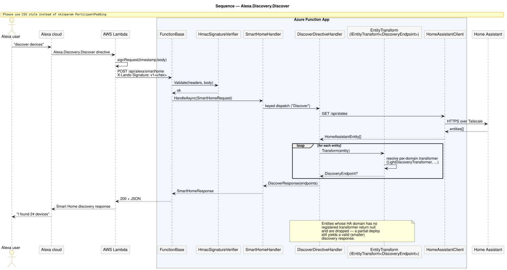
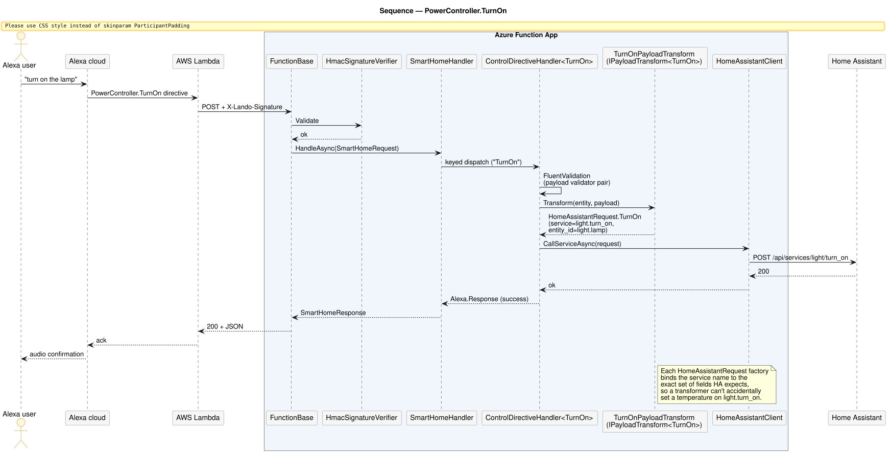
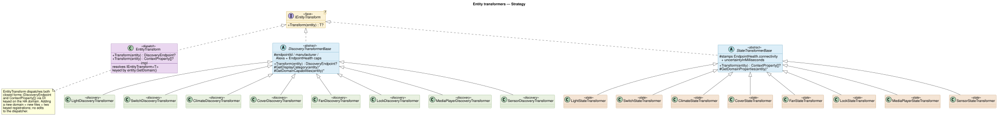
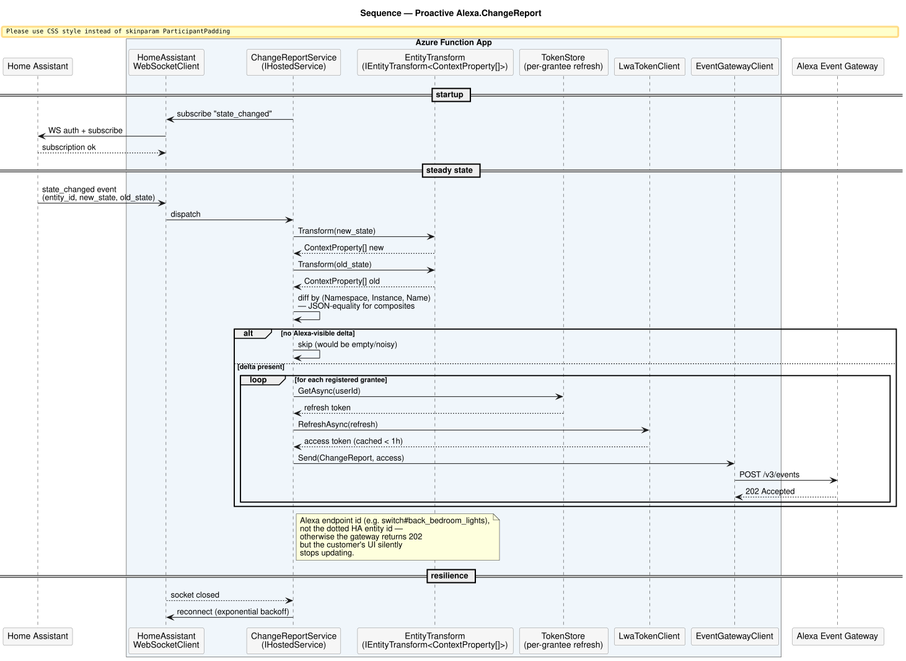
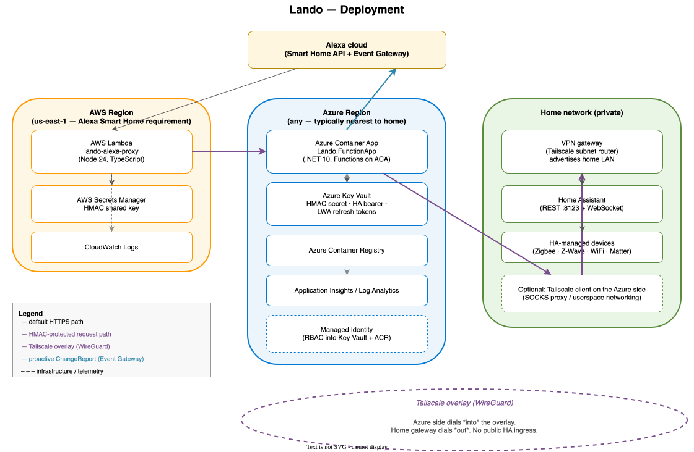
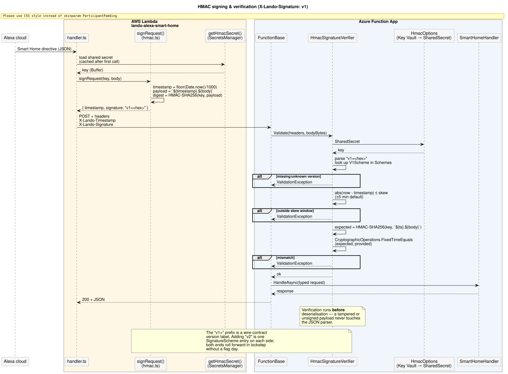

# Architecture

This document is for someone who has read the README, can build the
solution, and wants to understand how the pieces fit together before
they touch the code. The aim is to make the project legible without
forcing the reader to reverse-engineer it from a `grep`.

The bridge has two halves: a tiny AWS Lambda that fronts Amazon's Smart
Home gateway, and an Azure Container App that does the actual work.
Communication between the two is HMAC-signed; the Azure side reaches
Home Assistant over a Tailscale-routed HTTPS connection.


Inside the Azure Function App the projects fall out roughly as below.
The container view is where the patterns become obvious: a chain of
directive handlers in front of two layers of strategy transformers,
with a separate hosted service tailing the Home Assistant WebSocket.



Source for every diagram lives under `docs/assets/src/`;
`scripts/render-diagrams.sh` rebuilds the rendered output from the repo
root. Sequence, class, and deployment diagrams are linked from the
sections they illustrate, below.

## Code layout

The Azure side is split into five projects so the Smart Home layer stays
agnostic to both Azure and Home Assistant. The HMAC validator, JSON DTOs,
and dispatch logic can be unit-tested without standing up an HTTP server,
and the Home Assistant client can be swapped (different transport, recorded
fake) without touching the directive handlers.

| Project                            | Responsibility                                                                                                                                        |
| ---------------------------------- | ----------------------------------------------------------------------------------------------------------------------------------------------------- |
| `Lando.Abstractions`               | Transport-agnostic interfaces: `IRequestHandler`, `IRequestValidator`, `ITokenStore`, `LandoException`, `SecureString`. No Azure or Alexa references. |
| `Lando.Alexa.Core`                 | HMAC verification (`HmacSignatureVerifier`) and the LWA (Login-with-Amazon) token client. Knows nothing about Smart Home directives.                  |
| `Lando.Alexa.SmartHome`            | The directive handlers, payload validators, entity / payload transformers, and the proactive `ChangeReportService`. The bulk of the logic.            |
| `Lando.HomeAssistant.Abstractions` | HA-side interfaces and models: `IHomeAssistantClient`, `HomeAssistantEntity`, `HomeAssistantRequest`.                                                 |
| `Lando.HomeAssistant.Core`         | REST + WebSocket implementations of the HA interfaces, plus the keyed HTTP/socket handlers that own proxy and custom-CA TLS validation.               |
| `Lando.FunctionApp`                | The Azure Functions host: `FunctionBase<TRequest,TResponse>`, the `AlexaSmartHome` and `HealthCheck` triggers, and the Key Vault-backed `TokenStore`. |

The AWS side (`src/aws/lando-alexa-smart-home/`) is intentionally
single-purpose: receive from Alexa, sign with HMAC, forward to the Azure
Function. Its surface is small enough that a one-file architecture note in
its own README is sufficient.

## Inbound request pipeline

A Smart Home directive hits `Functions/Alexa/AlexaSmartHome.cs`, which is
a thin wrapper that delegates to `FunctionBase<Request, Response>`. The
base class runs the same pipeline for every directive:

1. **Buffer the body** up to a 6 MB cap (`StreamExtensions.CopyToAsync`).
   This caps memory before HMAC math runs and prevents an oversized payload
   from wedging an invocation.
2. **Verify HMAC** via the keyed `IRequestValidator` (in production this is
   always `HmacSignatureVerifier`). Verification happens _before_
   deserialisation: a tampered or unsigned payload never touches the JSON
   parser. Verification is constant-time
   (`CryptographicOperations.FixedTimeEquals`) and rejects requests outside
   the configured clock-skew window before any cryptographic work runs.
3. **Deserialise** into the typed request.
4. **Dispatch** to the keyed `IRequestHandler<TRequest, TResponse>`.
5. **Serialise the response**, redacting any field declared as
   `SecureString` whenever the request flows through the logging
   middleware (see `SecureString.WithRedactionEnabled`).

Validators and handlers are registered as a _pair_ under a shared DI key
(see `AddRequestHandler<,,>`): the same key resolves both, so there is no
code path that can hit a handler without going through its validator.

## Smart Home directive dispatch — Chain of Responsibility

Alexa Smart Home is a large, sparsely populated surface area: dozens of
directive names (`TurnOn`, `SetBrightness`, `AcceptGrant`, `Discover`,
`ReportState`, `SetColor`, …), each with its own payload shape and its
own translation rules. The bridge models this as a
**Chain-of-Responsibility** dispatch.

`SmartHomeHandler` (`src/azure/Lando.Alexa.SmartHome/Handlers/SmartHomeHandler.cs`)
is the entry point. It validates the inbound envelope and then resolves an
`IDirectiveHandler` from DI keyed by the directive name:

```csharp
var directive = request.Directive.Header.Name;
…
if (provider.GetKeyedService<IDirectiveHandler>(directive) is not IDirectiveHandler handler)
    throw new AlexaSmartHomeException(ErrorType.InvalidDirective, …);
…
await handler.HandleAsync(request, cancellationToken);
```

Each per-directive handler inherits from
`DirectiveHandler<TRequest, TResponse>`
(`Handlers/Directives/DirectiveHandler.cs`), which centralises the parts
that don't vary per directive — payload deserialisation, FluentValidation,
response envelope construction, redacted logging — so subclasses only
declare a `DirectiveName` and a `HandleAsync` body.

Concrete handlers, each registered under its `DirectiveNames.*` constant:

| Handler                          | Directive                                   | What it does                                            |
| -------------------------------- | ------------------------------------------- | ------------------------------------------------------- |
| `AcceptGrantDirectiveHandler`    | `Alexa.Authorization.AcceptGrant`           | One-time LWA code exchange + refresh-token persistence. |
| `DiscoverDirectiveHandler`       | `Alexa.Discovery.Discover`                  | Stream HA entities through the discovery transformer.   |
| `ControlDirectiveHandler<TReq>`  | `TurnOn`, `SetBrightness`, …                | Translate the directive into a HA service call.         |
| `ReportStateDirectiveHandler`    | `Alexa.ReportState`                         | Project current entity state to an Alexa state report.  |
| `ResumeScheduleDirectiveHandler` | `Alexa.ThermostatController.ResumeSchedule` | Acknowledged no-op (HA has no portable equivalent).     |

Adding a new directive is a three-step change with no edits to existing
code: subclass `DirectiveHandler<,>`, register it under the new directive
name with `AddKeyedScoped<IDirectiveHandler, NewHandler>(directiveName)`,
add a payload validator. The dispatch table never gets a hard-coded entry.



A `Discover` request walks the chain end-to-end:



A `PowerController.TurnOn` walks the same chain but exits through a
payload transformer into a Home Assistant service call:



## Entity transformation — Strategy

Home Assistant entities are typed by _domain_ (`light`, `switch`,
`climate`, `cover`, `media_player`, `lock`, `sensor`, `fan`, …) and each
domain projects into a different Alexa shape. The bridge models this as a
**Strategy** pattern.

The interface is in
`src/azure/Lando.Alexa.SmartHome/Abstractions/IEntityTransform.cs`:

```csharp
internal interface IEntityTransform<T> where T : class
{
    T? Transform(HomeAssistantEntity entity);
}
```

Two closed forms ship:

| Closed form                           | Used by                                                 | Produces                                                                                    |
| ------------------------------------- | ------------------------------------------------------- | ------------------------------------------------------------------------------------------- |
| `IEntityTransform<DiscoveryEndpoint>` | `DiscoverDirectiveHandler`                              | The endpoint shape Alexa wants in the discovery response (display category + capabilities). |
| `IEntityTransform<ContextProperty[]>` | `ReportStateDirectiveHandler` and `ChangeReportService` | The `context.properties` snapshot Alexa expects in state reports and ChangeReports.         |

Per-domain transformers live under
`src/azure/Lando.Alexa.SmartHome/Transformers/Entity/` — one `*DiscoveryTransformer`
and one `*StateTransformer` per supported HA domain. Both build on
shared base classes:

- `DiscoveryTransformerBase` factors out the parts of `DiscoveryEndpoint`
  that don't vary by domain (endpoint id, manufacturer, sanitised friendly
  name, the `Alexa` and `Alexa.EndpointHealth` capabilities). Subclasses
  override `GetDisplayCategory` and `GetDomainCapabilities`.
- `StateTransformerBase` stamps the `Alexa.EndpointHealth` `connectivity`
  property on every report and exposes a default `uncertaintyInMilliseconds`.
  Subclasses override `GetDomainProperties`.

The dispatcher is `EntityTransform`
(`Transformers/Entity/EntityTransform.cs`). It implements every closed
form of `IEntityTransform<T>` the bridge ships with, but its
implementation never produces a value on its own — it resolves the
per-domain transformer keyed on `entity.GetDomain()` from DI and delegates.

```csharp
private T? Transform<T>(HomeAssistantEntity entity) where T : class
    => provider.GetKeyedService<IEntityTransform<T>>(entity.GetDomain())
              ?.Transform(entity);
```

Adding a new domain is one new file per output shape (typically two:
discovery + state), plus two keyed registrations. The dispatcher does not
need to change. Entities whose domain has no registered transformer are
silently dropped during discovery so a partial deploy still yields a valid
discovery response — this is the deliberate "missing transformer is the
absence of evidence, not evidence of absence" stance.



## Control directive payload translation — Strategy (per-directive)

Inside the `Control*` branch there's a second layer of strategy: every
control directive payload has its own `IPayloadTransform<TPayload>`
implementation under `Transformers/Payload/`. `ControlDirectiveHandler<TReq>`
resolves the per-directive transformer keyed by directive name and asks
it to translate the validated payload into a `HomeAssistantRequest`:

```csharp
var request = provider
    .GetRequiredKeyedService<IPayloadTransform<TRequest>>(directiveName)
    .Transform(entity, payload);
await client.CallServiceAsync(request, cancellationToken);
```

Each `HomeAssistantRequest` factory (e.g. `HomeAssistantRequest.TurnOn`,
`HomeAssistantRequest.SetTemperature`) pairs a service name with the exact
set of fields HA expects for that service, so a transformer can't
accidentally set a `temperature` field on a `light.turn_on` call.

## SceneController — scenes and scripts

The `scene` and `script` domains surface as `Alexa.SceneController` endpoints
(`SceneDiscoveryTransformer` → `SCENE_TRIGGER`, `ScriptDiscoveryTransformer`
→ `ACTIVITY_TRIGGER`) and share a stateless `SceneControllerStateTransformer`
(no controller state — only the base `EndpointHealth` property). Scenes
advertise `supportsDeactivation: false` (HA has no `scene.turn_off`); scripts
advertise `true` (a running script is stopped with `script.turn_off`).

Their one wrinkle is the response shape: `SceneController` does not answer with
an `Alexa.Response` + context properties — it must reply in its own namespace
with a dedicated event name (`ActivationStarted` / `DeactivationStarted`) and a
`SceneActivationPayload` (cause + timestamp). Rather than a bespoke handler,
`ControlDirectiveHandler<TRequest>` was generalised into
`ControlDirectiveHandler<TRequest, TResponse>` — the dispatch flow (resolve
entity → keyed payload transform → service call → error wrap) is identical, and
the response is a subclass hook (`Response` plus the `Namespace`/`EventName`
virtuals). `SceneDirectiveHandler` is a thin subclass that returns a
`SceneActivationPayload` in the `Alexa.SceneController` namespace; Activate and
Deactivate reuse the existing `TurnOn`/`TurnOff` payload transforms (a
scene/script isn't a cover, so they fall through to `turn_on`/`turn_off`), with
the HA domain taken from the entity id so one handler serves both. This is the
pattern to follow for any future directive whose response differs from the
standard `Alexa.Response`.

## Proactive state — ChangeReportService

`Services/ChangeReportService.cs` is the long-running half of the bridge.
It's an `IHostedService` that subscribes to the Home Assistant WebSocket
`state_changed` event stream and, for each exposed entity:

1. Re-runs the state transformer (`IEntityTransform<ContextProperty[]>`)
   over both `new_state` and (when available) `old_state`.
2. Computes the delta — `(Namespace, Instance, Name)` triples whose
   `Value` actually moved. Composite values like `Temperature` or
   `HsbColor` fall back to JSON-equality comparison, so transformers
   don't all need to override `Equals`.
3. If anything changed, builds an `Alexa.ChangeReport` event and POSTs
   it to the Alexa Event Gateway for _every_ registered grantee.
4. Skips empty deltas — HA's `state_changed` fires on `last_updated`
   bumps that don't move any Alexa-visible property; sending an empty
   `ChangeReport` would be noisy and the gateway rejects it.

The WebSocket connection reconnects with exponential backoff on drop, and
the diff step uses the _Alexa_ endpoint id (`switch#back_bedroom_lights`),
not the dotted HA entity id — the gateway returns 202 either way, but
ChangeReports keyed on the dotted form never route to a known endpoint
and the customer's UI silently stops updating.



## Token storage — `ITokenStore`

LWA refresh tokens are persisted per grantee in Azure Key Vault (see
`Lando.FunctionApp/Security/TokenStore.cs`). The keys are SHA-256
suffixes of the LWA `user_id` (hashed for Key Vault's
`[A-Za-z0-9-]{1,127}` naming rule, not for security). Access tokens are
minted on demand from the refresh token and cached in `IMemoryCache`
for the smaller of the token's actual remaining lifetime (minus a 60s
safety buffer) and one hour.

Pulling the persistence concern behind `ITokenStore`
(`Lando.Abstractions/Security/ITokenStore.cs`) is what keeps the
`Lando.Alexa.SmartHome` layer free of any Key Vault coupling — the
Smart Home code asks `ITokenStore.GetAsync(userId, …)` and doesn't know
or care whether the secret lives in Key Vault, Postgres, or an
in-memory test double.

## Deployment topology

A first-party view of where the components actually run. AWS Lambda is
pinned to `us-east-1` because that's the only region the Alexa Smart Home
gateway invokes; the Azure side can sit anywhere convenient. The home
network never accepts inbound from the public internet — both ends dial
into the Tailscale overlay.



## Transport security

| Hop                                  | Authentication                                                                                                                              |
| ------------------------------------ | ------------------------------------------------------------------------------------------------------------------------------------------- | --- | ------------------------------------------------------------------------------------------------------------- |
| Alexa cloud → AWS Lambda             | Alexa's own bearer token (validated by `TokenValidator` against the LWA `tokeninfo` endpoint; `aud` claim pinned to the skill's client_id). |
| AWS Lambda → Azure Function          | HMAC-SHA256 over `"{timestamp}."                                                                                                            |     | body`, versioned via the `X-Lando-Signature: v1=<hex>` header. Constant-time verification, ±5 min clock skew. |
| Azure Function → Home Assistant      | Long-lived HA bearer token over HTTPS. Optional Tailscale SOCKS proxy + optional pinned custom CA (`X509Certificate2Extensions.IsValid`).   |
| Azure Function → Alexa Event Gateway | OAuth2 bearer minted from per-grantee refresh token (`LwaTokenClient.RefreshAsync`).                                                        |

The signing scheme on the AWS↔Azure hop is versioned (`X-Lando-Signature: v1=…`)
and verified before any JSON parsing runs:



## Adding things

- **A new Smart Home directive.** Subclass `DirectiveHandler<,>`, add a
  payload validator, register the handler with
  `services.AddKeyedScoped<IDirectiveHandler, NewHandler>(DirectiveNames.NewName)`.
  If the directive translates to a HA service call, also add an
  `IPayloadTransform<TPayload>` and a `HomeAssistantRequest` factory.
- **A new Home Assistant domain.** Add two transformer classes
  (discovery + state) under `Transformers/Entity/`, register each under
  the domain name as `services.AddKeyedScoped<IEntityTransform<DiscoveryEndpoint>, …>(domain)`
  and the corresponding `IEntityTransform<ContextProperty[]>` registration.
  See `docs/extending-device-types.md` (added in Phase 5) for a worked example.
- **A new signature scheme.** Add a `SignatureScheme` subclass inside
  `HmacSignatureVerifier` and register it in the `Schemes` table under a
  new version label. The Lambda signer adopts the new label and both ends
  roll forward in lockstep.
